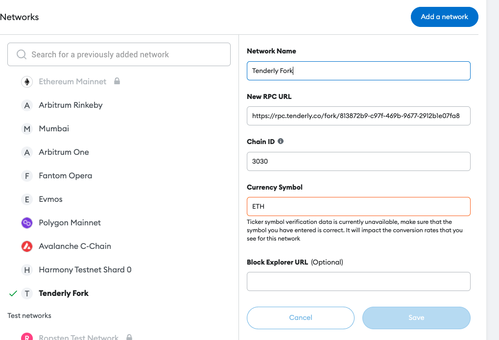

# Fork setup

## Installation

1. copy .env.test to .env and fill your credentials
2. `npm i` install dependencies

## Getting started

```
npm run start
```

This will console log sth like:

``` ✔  6s 

> tenderly-fork@1.0.0 start
> node create.js

Creating fork for 137 on 3030
rpcUrl https://rpc.tenderly.co/fork/<id>
chainId 3030

No ETH_ADDRESS was provided so funding is skipped.
To use this fork on the aave interface type the following commands in the console.
--------------
localStorage.setItem('forkEnabled', 'true');
localStorage.setItem('forkBaseChainId', 137);
localStorage.setItem('forkNetworkId', 3030);
localStorage.setItem("forkRPCUrl", "https://rpc.tenderly.co/fork/<id>");
--------------
warning: the fork will be deleted once this terminal is closed
```

1. First copy the 4 `localStorage` statements to your browser console of a running aave app
2. Setup a metamask fork with `forkNetworkId`(3030 in the example) and rpc `https://rpc.tenderly.co/fork/<id>` -> switch to the network
3. Reload the page

You should now have a custom fork running with an addition of 10000 of the base network currency in your wallet.
In addition to that new fork markets should have appeared in the market selection suffixed with the `fork` keyword.
This is the market of your fork.

Switch to the market and do whatever you want :tada:, always double check the selected network in your wallet provider to make sure transactions are executed only on the fork network.

If you are using metamask, make sure to configure the tenderly fork rpcurl into your network config, see below as an example

